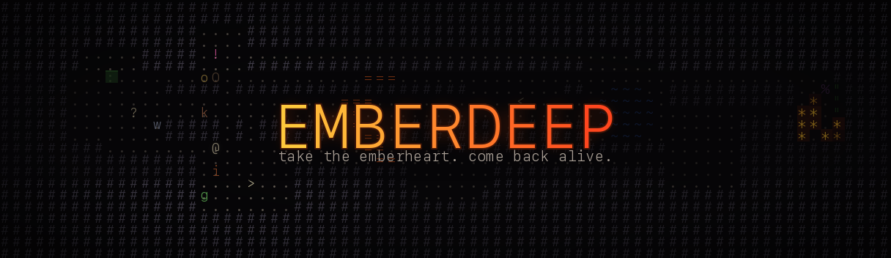

# EMBERDEEP

A small Brogue-like ASCII roguelike in true color: dark jewel-toned dungeons,
field-of-view lighting, risky item identification, and terrain that fights
back — spreading fire, explosive gas pockets, water, lava. Descend to depth
15, take the **Emberheart**, and climb back out alive.

Built with [python-tcod](https://github.com/libtcod/python-tcod). No assets,
no build step, pure ASCII.

## Run it

```sh
python3 -m venv .venv
.venv/bin/pip install -r requirements.txt
.venv/bin/python -m emberdeep        # or: python main.py
```

The game renders glyphs from a system monospace font. If none of the built-in
candidates work on your machine:

```sh
EMBERDEEP_FONT=/path/to/mono.ttf .venv/bin/python -m emberdeep
```

## Controls

| key | action |
|---|---|
| arrows / numpad / `hjkl` + `yubn` | move (bump to attack) |
| `.` or numpad `5` | wait a turn |
| `>` / `<` | descend / ascend stairs |
| `g` | pick up |
| `i` | inventory (use / equip / remove; `d` to drop) |
| `x` | look around |
| `q` | abandon run / quit |

## The game

- **15 depths, permadeath.** XP from kills; each level offers +strength,
  +accuracy, or +max HP.
- **Identify minigame.** Potions and scrolls start shuffled ("a murky crimson
  potion"). Quaffing identifies the type for the run — but some potions are
  incineration. Scrolls of identify play it safe. Enchanted gear shows as
  "unusual" until worn once (no curses; we're not monsters).
- **Terrain matters.** Lichen and glowfungus burn; fire spreads. Gas vents
  fill rooms with a flammable haze — one spark and the whole pocket goes up.
  Water douses burning; lava is a bad place to stand. Imps and firebolts
  weaponize all of it.
- **Diablo-style itemization.** Weapons, armor, and rings drop as normal /
  magic (1–2 affixes) / rare (3–4), with depth-weighted odds. Fourteen
  affixes from `Ember` (fire damage) to `of Swiftness` (free turns).
- **Eight legendaries**, one copy each per run, each a build-around:
  *Emberbrand* (ignites terrain on hit), *Stormcall* (chain lightning),
  *Whisperfang* (backstab ×3), *Grudgekeeper* (damage grows with your
  wounds), *Gloomward* (fire/gas immunity, less light), *Bulwark of the
  Deep*, *Ring of the Salamander* (lava heals you), *Ring of Echoes*
  (kills may raise allied shades).
- **Eleven monsters**, each with one trick: bats flutter randomly, goblins
  rout, jellies split, imps hurl fire, wraiths blink away when struck,
  ogres are slow and enormous, the Ember Warden guards the Heart.

## Development

Docs live in `docs/`: [player's guide](docs/guide.md),
[original design plan](docs/design-plan.md),
[decision log](docs/decision-log.md).

```sh
.venv/bin/python -m pytest tests/            # 26 seeded tests, no window needed
.venv/bin/python scripts/balance_probe.py    # duel matrix: avg HP lost per kill
```

Layout: `emberdeep/engine.py` (state + turn loop), `dungeon.py` (generation),
`terrain.py` (fire/gas sim), `entities.py` (bestiary + AI), `combat.py`,
`items.py` (affixes/legendaries), `identify.py`, `actions.py` (player verbs),
`render.py` + `ui.py` + `screens.py` (presentation), `__main__.py` (SDL loop).
All map arrays are indexed `[x, y]`; all randomness flows through one seeded
`random.Random`.
